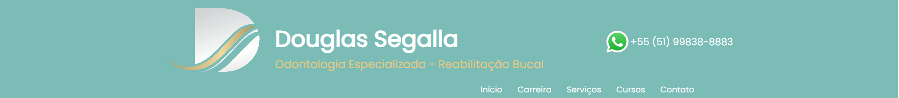
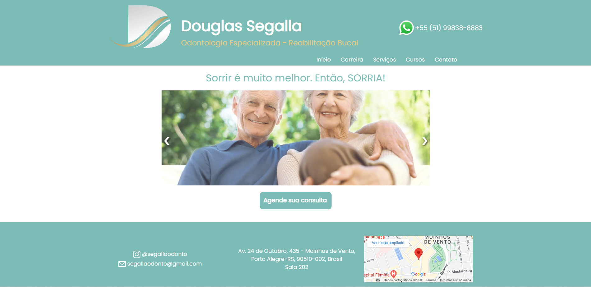
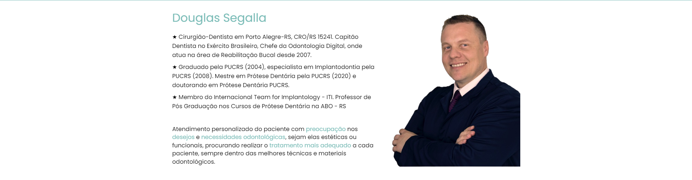
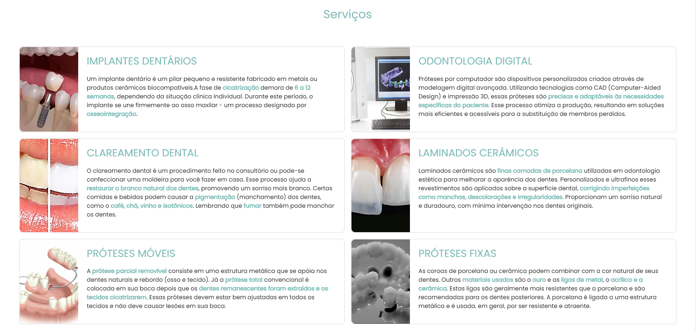
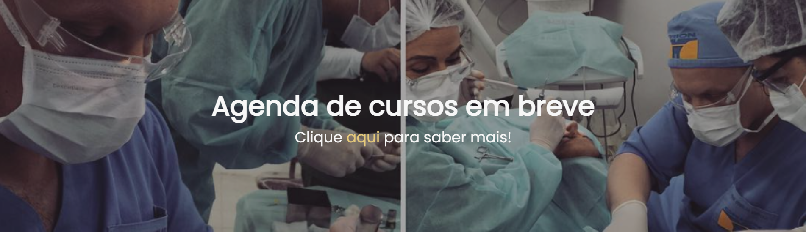
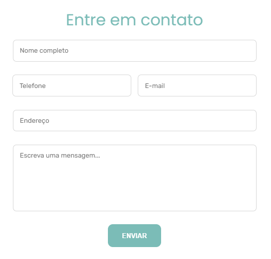
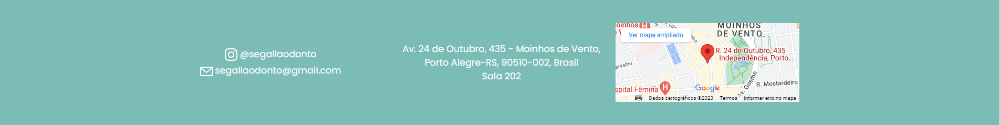

# 🦷 Segalla Odonto 🪥

## Resumo ℹ️

Projeto realizado em uma disciplina proporcionada pela Universidade La Salle, a qual tinha o objetivo de realizar um site com os seguintes pré-requisitos:

* Mínimo de 5 interfaces
* Utilização de banco de dados ou formulário
* Utilização de javascript
* Utilização de alguma estilização a exemplo de CSS, bootstrap
* Utilização de imagens, links
* Criação da documentação do código

## Tecnologias 🧰

Aqui estão as tecnologias utilizadas no projeto.

* HTML
* CSS
* JavaScript
* PHP
* Composer
* Laravel
* Git

## Site 🌐

### 1 - Menu 📌

### 2 - Início ✨

### 3 - Carreira 🎖️
* Conta um pouco da carreira do dentista

### 4 - Serviços 💼
* Mostra informações dos serviços que o dentista realiza.

### 5 - Cursos 📚
* Mostra informações dos serviços que o dentista realiza.

### 6 - Contato 📞
* Formulário de contato

### 7 - Footer 🥾
* Mostra informações dos serviços que o dentista realiza.

## Explicação 
* Rotas: Cada rota é o nome do seu respectivo link no menu (/carreira, /servicos, /cursos e /contato), exceto a de Início que é a rota index do site (/);
* Início: Mostra uma página de boas-vindas ao usuário;
* Carreira: Informações sobre a carreira do dentista, como formação e experiência;
* Serviços: Informações dos principais serviços realizados pelo dentista;
* Cursos: Mostra um aviso para conscientizar o usuário que em 2024 haverá novos cursos ministrados pelo dentista, juntamente com um link (na palavra "aqui") para a página de contato (caso o usuário queira saber mais informações);
* Contato: Um formulário para o usuário poder enviar alguma dúvida ou até mesmo marcar uma consulta por e-mail. Ao enviar o formulário, por meio do [FormSubmit](https://formsubmit.co/),  é possível que o e-mail seja enviado sem um Back-End por trás dessa funcionalidade;
* Links: De navegação há Início, Carreira, Serviços, Cursos e Contato. O botão da página de Início é um link, o qual redireciona o usuário para a página de contato. Existe um link com o Instagram do dentista no footer (que ao ser clicado leva diretamente para o Instagram). E, sendo uma outra forma de contato, o número do WhatsApp no header (que ao ser clicado leva diretamente ao WhatsApp);