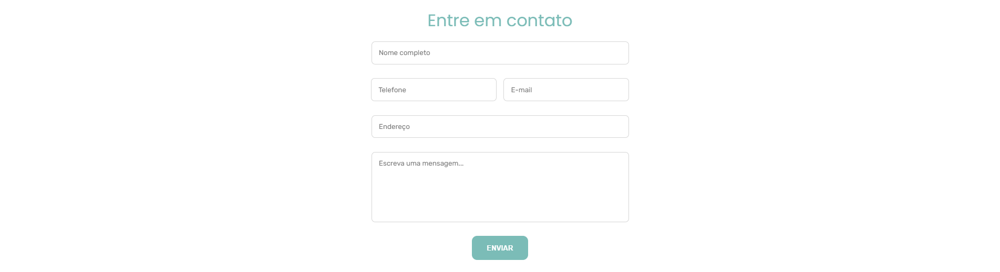

# 🦷 Segalla Odonto 🪥

## Resumo ℹ️

Projeto realizado em uma disciplina proporcionada pela Universidade La Salle, a qual tinha o objetivo de realizar um site com os seguintes pré-requisitos:

* Mínimo de 5 interfaces
* Utilização de banco de dados ou formulário
* Utilização de javascript
* Utilização de alguma estilização a exemplo de CSS, bootstrap
* Utilização de imagens, links
* Criação da documentação do código

## Tecnologias 🧰

Aqui estão as tecnologias utilizadas no projeto.

* HTML
* CSS
* JavaScript
* PHP
* Composer
* Laravel
* Git

## Site 🌐

### 1 - Menu 📌

### 2 - Início ✨

### 3 - Carreira 🎖️
* Conta um pouco da carreira do dentista

### 4 - Serviços 💼
* Mostra informações dos serviços que o dentista realiza.

### 5 - Cursos 📚
* Mostra informações dos serviços que o dentista realiza.

### 6 - Contato 📞
* Formulário de contato

### 7 - Footer 🥾
* Mostra informações dos serviços que o dentista realiza.

